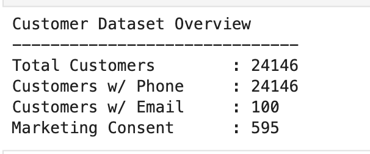
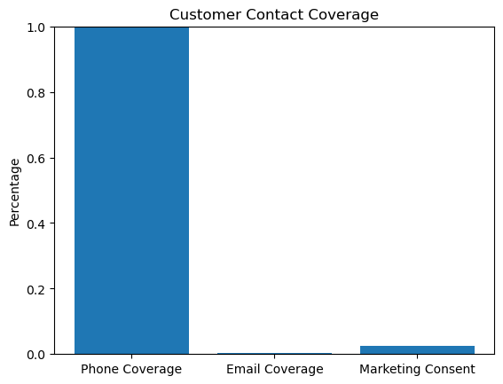
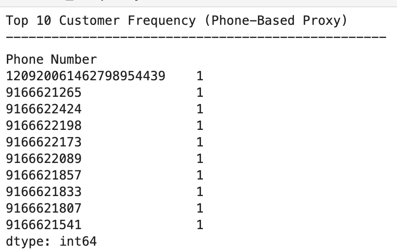
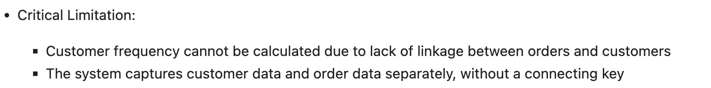
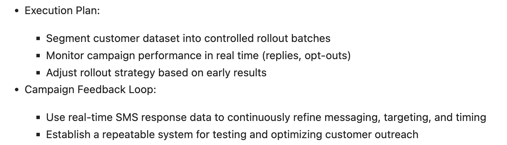
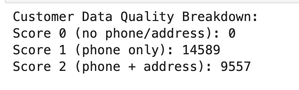
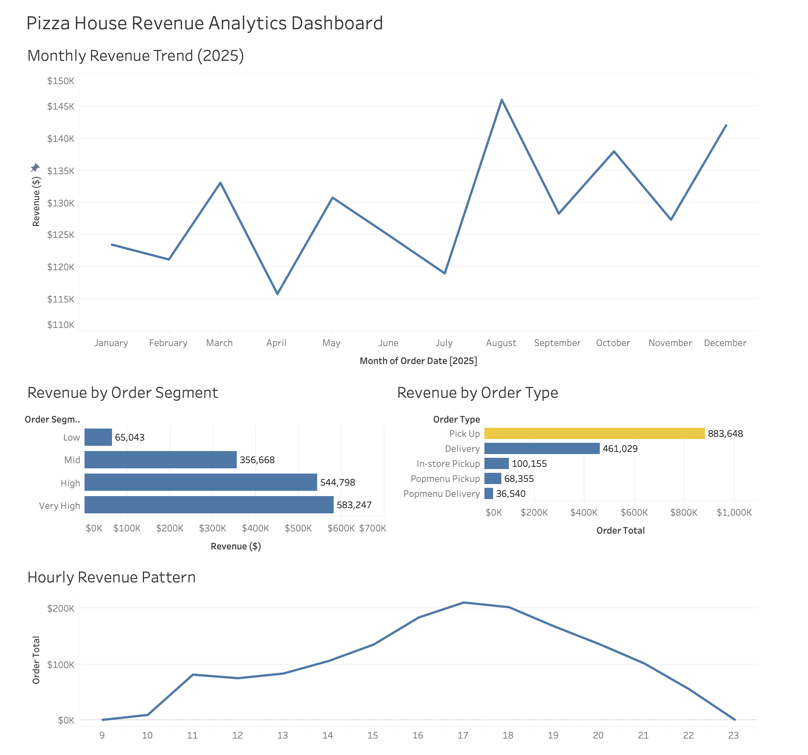

# 🍕 Pizza House Sales Analysis — Revenue Optimization & Operational Strategy System

## 🚀 Start Here

* Start with **Workbook 12** → Strategic Recommendations
* Then **Workbook 13** → Customer Data & Revenue Activation
* Then **Workbook 11** → Operations
* Then **Workbooks 8–9** → Revenue Drivers
* Finish with **Workbooks 14–15** → Tableau Executive Intelligence Layer

### 📊 Interactive Tableau Dashboard

**Tableau Public:**
https://public.tableau.com/app/profile/fernando.romero4463/viz/wb15_tableau_revenue_dashboard/PizzaHouseRevenueAnalyticsDashboard2025?publish=yes

---

## 📊 Overview

This project analyzes POS data to uncover:

* Revenue drivers
* Operational bottlenecks
* Customer behavior
* Growth opportunities
* Executive business intelligence insights

> Goal: Identify revenue growth opportunities through operational optimization, customer activation, and business intelligence.

---

# 🔍 Revenue Concentration (Workbook 8)


* Revenue follows a Pareto distribution
* Small number of SKUs drive majority of revenue

---

# 📦 Order Distribution


* Orders are right-skewed
* High-value orders drive disproportionate revenue

---

# ⏰ Demand Patterns


* Peak: **4pm–7pm**
* Strong weekend lift

---

# ⚙️ Operations Insight (Workbook 11)

* Peak hours are **capacity constrained**
* Kitchen is bottleneck
* Off-peak = underutilized

> Revenue is constrained by execution, not demand

---

# 💰 Strategy Layer (Workbook 12)


* AOV expansion (bundles, upsells)
* Peak throughput optimization
* Off-peak demand generation

---

# 📱 Customer Data & Revenue Activation (Workbook 13)

## 📊 Customer Dataset Overview



* ~24K customers
* 100% phone coverage
* Minimal email / consent

---

## 📉 Contact Coverage Problem



* Email ≈ 0.4%
* Marketing consent ≈ 2.5%

👉 Most customers are **not marketable**

---

## 🔍 Attempted Frequency Analysis



* No repeat behavior detected

👉 Not a data issue — a **system issue**

---

## ⚠️ Root Cause: POS Limitation



* Orders not linked to customers
* No retention / LTV possible

---

## 💰 Solution: Revenue Activation System



* SMS campaign using phone numbers
* Grand reopening positioning
* Reply-based validation

---

## 🚀 Real-World Execution



* ~9,500 customer SMS dataset built
* Batched rollout strategy
* Engagement used as validation layer

---

## 🔥 Final Insight

> The problem is not lack of data — it’s lack of **connection and activation**

---

# 📊 Tableau Executive Intelligence Layer (Workbooks 14–15)

## 🧠 From Analysis → Business Intelligence

The final phase of this project transformed analytical findings into recruiter-ready Tableau dashboards designed for executive storytelling and operational decision-making.

---

## 📈 Revenue Analytics Dashboard



The dashboard consolidates four complementary perspectives of revenue performance:

* Revenue trends across the full year
* Revenue concentration by spending segment
* Revenue contribution by fulfillment channel
* Revenue patterns throughout the day

### 🔗 Live Dashboard

https://public.tableau.com/app/profile/fernando.romero4463/viz/wb15_tableau_revenue_dashboard/PizzaHouseRevenueAnalyticsDashboard2025?publish=yes

---

## 📅 Monthly Revenue Trend (2025)

* Revenue remained relatively stable throughout 2025
* Moderate seasonal fluctuations were observed
* No evidence of structural decline

---

## 💳 Revenue by Order Segment

* **Very High** and **High** spending segments generated the majority of revenue
* Low-value transactions contributed minimally despite higher frequency

> Revenue growth is more likely to come from increasing AOV than increasing transaction volume.

---

## 🚗 Revenue by Order Type

* Pick Up remained the dominant fulfillment channel
* Delivery represented a secondary revenue stream
* Alternative channels contributed relatively little to overall performance

> Operational improvements should prioritize the highest-performing channels first.

---

## ⏰ Hourly Revenue Pattern

* Revenue peaked during the late afternoon and early evening
* Demand tapered significantly outside peak operating windows

> Staffing decisions should align with observed demand patterns.

---

## 🎯 Tableau Deliverables

* Interactive Tableau Revenue Dashboard
* Dashboard-ready analytical dataset
* Tableau Public portfolio asset
* GitHub business intelligence showcase
* LinkedIn Featured integration

---

## 🔥 Final Insight

> The greatest opportunity for Pizza House lies in optimizing execution during existing demand peaks while increasing value captured from each transaction.

---

# 📁 Repo Structure

```text
pizza-house-sales-analysis/
│
├── data/
│   ├── raw/
│   └── cleaned/
│       └── orders_2025_tableau.csv
│
├── notebooks/
│   ├── 14_tableau_executive_intelligence_layer.ipynb
│   └── 15_tableau_executive_dashboard_suite.ipynb
│
├── dashboards/
│   ├── wb15_tableau_revenue_dashboard.twbx
│   └── PH_15_01_Revenue_Analytics_Dashboard.png
│
├── visuals/
│
└── README.md
```

---

# 🛠️ Tools

* Python (pandas, matplotlib)
* SQL (DuckDB)
* Tableau Public
* Jupyter Notebook

---

# 👤 Author

**Fernando Romero**

Revenue & Operations Analytics | SQL • Python • Tableau | Forecasting • Business Intelligence • Operational Strategy
