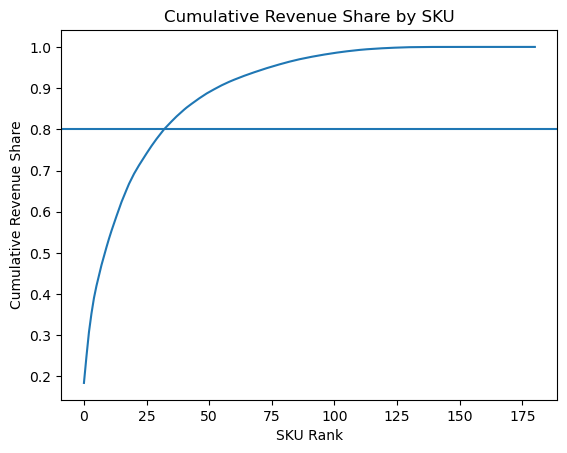
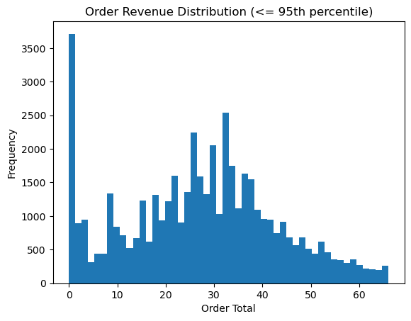
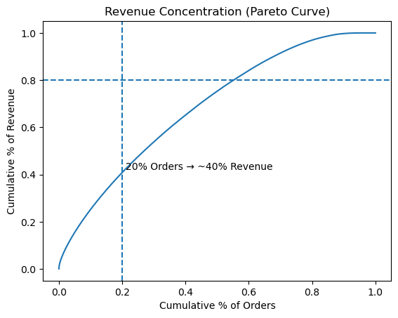
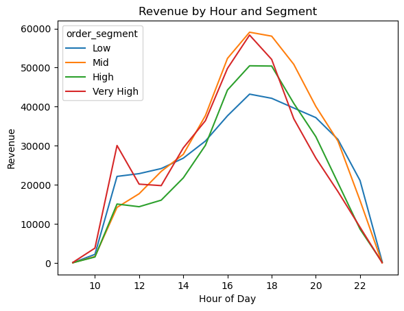
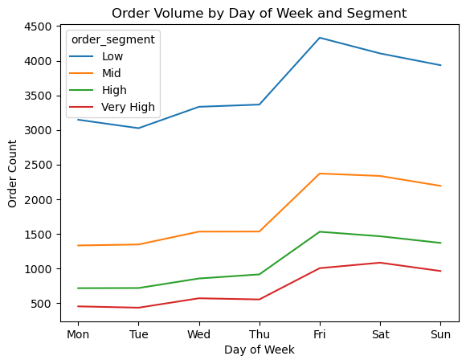

# 🍕 Pizza House Sales Analysis — End-to-End Revenue & Customer Intelligence System

## 📊 Overview

This project analyzes point-of-sale (POS) data from a pizza restaurant to uncover **revenue drivers, customer behavior, and strategic growth opportunities**.

Rather than a single notebook, this project is built as a **multi-workbook analytics system**, progressing from raw data ingestion to executive-level business insights.

---

## 🔧 Data Pipeline (Workbooks 1–7)

A structured data pipeline was developed to transform raw Clover POS exports into a clean, analysis-ready dataset.

Key steps included:

* Cleaning and parsing irregular POS report exports  
* Identifying true header rows within noisy files  
* Standardizing column names and data types  
* Handling SKU naming inconsistencies (e.g., size variants)  
* Mapping categories and product hierarchies  
* Engineering `realized_revenue` (net of discounts)  
* Creating deterministic, reproducible transformations  

This pipeline ensures all downstream analysis is built on **reliable, consistent data**.

---

## 🎯 Objectives

* Identify which menu items (SKUs) drive the majority of revenue  
* Quantify the impact of discounts on realized revenue  
* Detect structural pricing and promotion inefficiencies  
* Understand customer order behavior and segmentation  
* Prioritize high-impact opportunities for revenue optimization  

---

# 🔍 Revenue Optimization (Workbook 8)

## 🥇 SKU Revenue Concentration

* A small subset of SKUs drives the majority of total revenue  
* Menu performance follows a classic Pareto distribution  

---

## 💸 Discount Behavior

* Most SKUs experience minimal discount pressure  
* Discounting is concentrated in a small subset of items  
* Indicates strong pricing power across the majority of the menu  

---

## 🚀 Opportunity Identification

* Revenue expansion opportunities are concentrated in large and extra-large pizzas  
* Suggests pricing inefficiencies at higher size tiers  
* Indicates potential for targeted price optimization  

---

# 👥 Customer & Order Segmentation (Workbook 9)

This phase extends the analysis from **what drives revenue → how customers generate it**.

---

## 📊 Order Value Distribution

* Order values are right-skewed, with most orders concentrated in lower price ranges  
* Outliers removed using 95th percentile filtering for accurate segmentation  

---

## 🧠 Revenue Concentration (Order-Level)

* ~20% of orders generate ~40% of revenue  
* Revenue is moderately concentrated across higher-value orders  

---

## ⏰ Revenue by Hour and Segment

* Revenue peaks between **5 PM – 6 PM**, aligning with dinner demand  
* Mid and high-value segments dominate peak hours  
* Low-value orders contribute volume but less revenue impact  

---

## 📅 Order Volume by Day of Week

* Order volume increases significantly toward **Friday–Sunday**  
* Weekend demand is driven across all segments  
* Suggests strong opportunity for weekend-focused promotions  

---

# 🧠 Key Business Insights

### 💰 Revenue Structure
* Revenue is driven by both **top-performing SKUs** and **higher-value orders**  
* No single point of failure — healthy distribution across products and customers  

### 🍕 Product Strategy
* Large and extra-large pizzas represent the highest pricing opportunity  
* Targeted pricing adjustments can unlock incremental revenue  

### 👥 Customer Behavior
* High-value orders disproportionately drive revenue  
* Peak demand occurs during dinner hours and weekends  

### 📈 Growth Opportunities
* Optimize pricing at high-value SKU tiers  
* Reduce unnecessary discounting on strong-performing items  
* Leverage peak hours and weekends for targeted promotions  
* Develop strategies to increase average order value (AOV)  

---

# 🕊️ Strategic Direction

This project evolves from:

**Menu Optimization → Revenue Optimization → Customer Intelligence**

Future enhancements could include:

* Customer lifetime value (CLV) modeling  
* Retention and repeat purchase analysis  
* Promotion effectiveness tracking  
* Demand forecasting integration with staffing and inventory  

---

## 🛠️ Tools & Technologies

* Python (pandas, matplotlib)  
* Jupyter Notebook  
* Data cleaning & feature engineering  
* Exploratory data analysis  
* Business strategy modeling  

---

## 📁 Project Structure

* `notebooks/` → step-by-step analytical workbooks  
* `visuals/` → exported charts for presentation  
* `data/` → raw and cleaned datasets (excluded for privacy)  

---

## ⚠️ Notes

Data files are not included in this repository.  
This project focuses on **analysis methodology and business insights** rather than raw data distribution.

---

## 👤 Author

Fernando Romero
