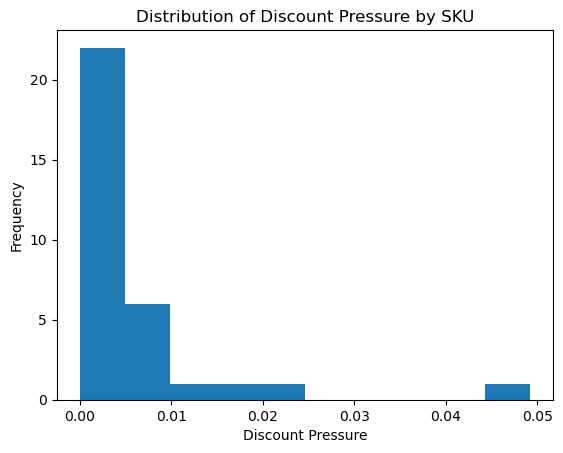
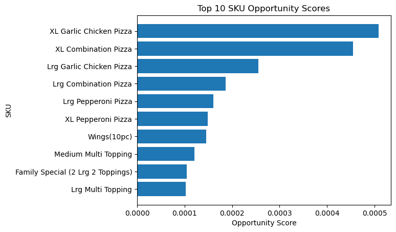

# 🍕 Pizza House Sales Analysis — End-to-End Revenue & Strategy System

## 📊 Overview

This project analyzes point-of-sale (POS) data from a pizza restaurant to uncover revenue drivers, pricing inefficiencies, and strategic growth opportunities.

Unlike a single analysis notebook, this project represents a **multi-workbook data system**, progressing from raw data ingestion to business strategy.

---

## 🔧 Data Pipeline (Workbooks 1–7)

A structured data pipeline was built to transform raw Clover POS exports into a clean, analysis-ready dataset.

Key steps included:

* Cleaning and parsing irregular POS report exports
* Identifying true header rows within noisy files
* Standardizing column names and data types
* Handling SKU naming inconsistencies (e.g., size variants)
* Mapping categories and product hierarchies
* Engineering `realized_revenue` (net of discounts)
* Creating deterministic, reproducible transformations

This pipeline ensures all downstream analysis is built on reliable, consistent data.

---

## 🎯 Objectives

* Identify which menu items (SKUs) drive the majority of revenue
* Quantify the impact of discounts on realized revenue
* Detect structural pricing and promotion inefficiencies
* Prioritize high-impact opportunities for revenue optimization

---

## 🔍 Revenue Optimization (Workbook 8)

### 🥇 Revenue Concentration (Pareto Effect)

* ~20–25% of SKUs generate ~80% of total revenue
* Revenue is concentrated but not overly dependent on a small set of items

---

### 💸 Discount Behavior

* Most SKUs exhibit minimal discount pressure
* Discounting is concentrated in a small subset of items
* Indicates strong pricing power across the majority of the menu

---

### 🚀 Opportunity Identification

* High-impact opportunities are concentrated in large and extra-large pizza SKUs
* Suggests structural pricing inefficiencies at higher size tiers
* Opportunity exists for targeted pricing adjustments rather than broad changes

---

## 🧠 Strategic Recommendations

* Focus optimization efforts on top revenue-driving SKUs
* Reduce discounting on high-performing items where demand is strong
* Re-evaluate pricing structure across size tiers (Medium → Large → XL)
* Optimize bundle and combo pricing strategies

---

## 🔮 Next Phase — Customer & Order Segmentation (Workbook 9)

Upcoming analysis will extend the system to include customer behavior:

* Segment customers by revenue contribution and frequency
* Identify high-value and repeat customer groups
* Analyze order patterns and purchase behavior
* Connect customer segments to pricing and promotion strategy

This will evolve the project from **menu optimization → full business intelligence system**.

---

## 🛠️ Tools & Technologies

* Python (pandas, matplotlib)
* Jupyter Notebook
* Data cleaning & feature engineering
* Exploratory data analysis
* Business strategy modeling

---

## 📁 Project Structure

* `notebooks/` → step-by-step analytical workbooks
* `visuals/` → exported charts for presentation
* `data/` → raw and cleaned datasets (not included for privacy)

---

## ⚠️ Notes

Data files are not included in this repository.
This project focuses on analysis methodology and business insights rather than raw data distribution.

---

## 👤 Author

Fernando Romero
